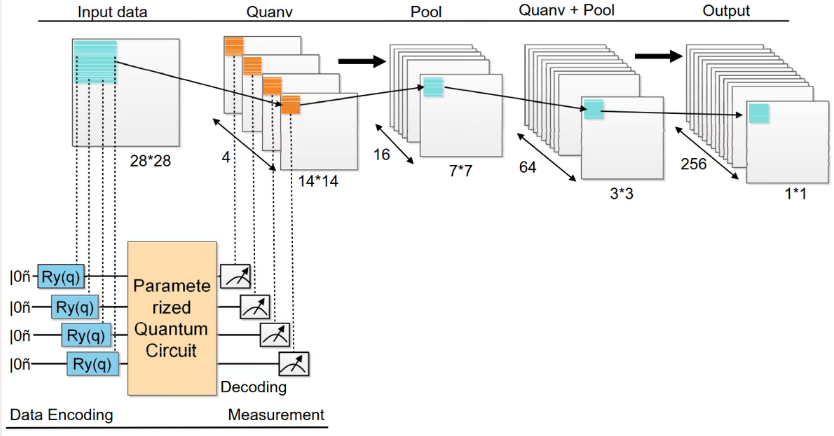
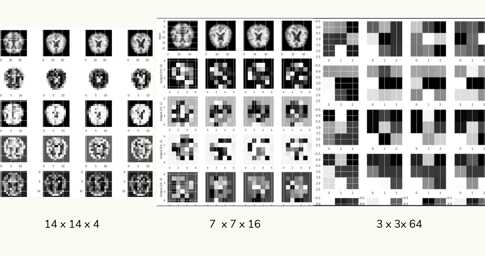
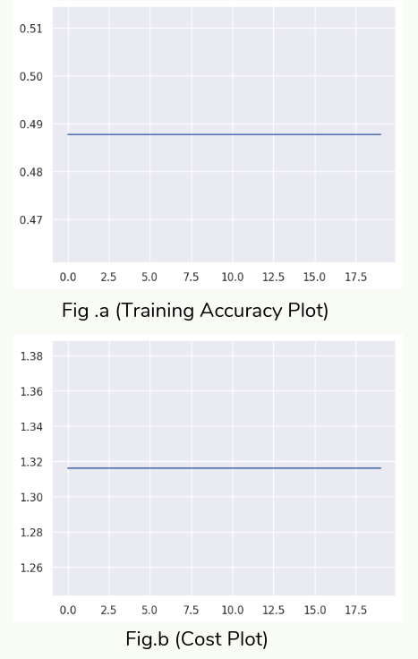

# 🧠 Quantum-Enhanced CNN for Alzheimer’s Disease Classification

This repository contains a hybrid **quantum-classical deep learning model** for classifying Alzheimer’s Disease from brain MRI images using **Convolutional Neural Networks (CNNs)** and **Quanvolutional (Quantum Convolutional) layers**.

This work was presented at the **4th International Convention on Green Environment, Technology & Entrepreneurship through Innovation (ICGETEI)**, Amity University, Rajasthan.

**Author:** Nischay Mehta  
**Institute:** Amity Institute of Biotechnology, Amity University Rajasthan

---

## 📌 Project Overview

Alzheimer’s Disease is a progressive neurodegenerative disorder. This project explores the integration of **quantum computing with deep learning** to enhance medical image classification by leveraging quantum feature transformations.

The model combines:
- Classical CNN layers for feature extraction
- Variational quantum circuits for quanvolutional feature mapping
- A hybrid quantum-classical learning pipeline

---

## 🧪 Dataset

- Source: Kaggle — Alzheimer’s Multiclass Dataset (Equal and Augmented)  
- Link: https://www.kaggle.com/datasets/aryansinghal10/alzheimers-multiclass-dataset-equal-and-augmented

### Dataset Details
- MRI brain images
- Four classes:
  - Normal
  - Very Mild Demented
  - Mild Demented
  - Moderate Demented
- Balanced and augmented dataset
- Publicly available for research and educational use

In this project:
- Training samples: 5120  
- Testing samples: 1481  
- Image resolution used: 28×28 (due to computational constraints)

> ⚠️ Due to dataset licensing, size, and medical data considerations, the raw MRI data is not included in this repository.  
> Please download the dataset directly from Kaggle using the link above and place it in the appropriate data directory as described in `scripts/data_instructions.md`.

---

## ⚛️ Quantum Model Details

- Frameworks:
  - PennyLane
  - TensorFlow Quantum
  - Keras
- Quantum device: PennyLane `default.qubit`
- Number of qubits: 4
- Quantum encoding: Local Ry rotations
- Circuit structure:
  - Embedding layer
  - Random parameterized quantum layers
  - Measurement in computational basis
- Quanvolution applied on 2×2 image patches

---

## 🏗️ Architecture

The hybrid architecture consists of:
- Classical convolutional layers
- Quanvolutional quantum layers
- Pooling and flattening layers
- Final classification layers

---

## 📊 Results

- Training Accuracy: ~48%
- Cost: ~1.31

Quantum feature map dimensions:
- 14 × 14 × 4
- 7 × 7 × 16
- 3 × 3 × 64

> Note: Performance is limited by the number of available qubits and reduced image resolution.

---

## 🔮 Limitations & Future Work

- Increase image resolution (e.g., 256×256)
- Use more qubits for richer quantum feature maps
- Execute circuits on real quantum hardware
- Deeper quanvolutional architectures
- Noise-aware quantum training

---

## 📁 Repository Structure

