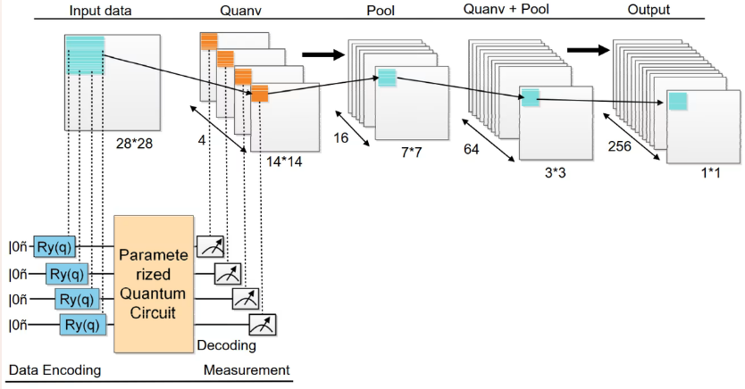
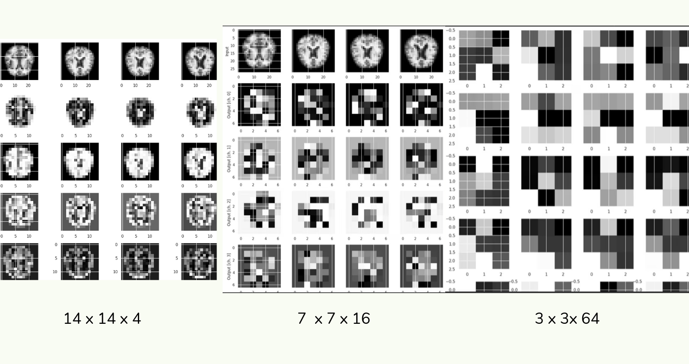
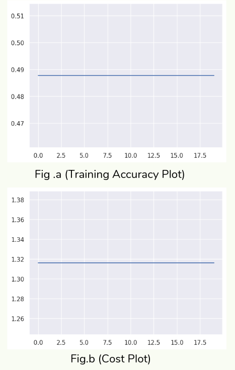

# 🧠 Quantum-Enhanced CNN for Alzheimer’s Disease Classification

This repository contains a hybrid **quantum-classical deep learning model** for classifying Alzheimer’s Disease from brain MRI images using **Convolutional Neural Networks (CNNs)** and **Quanvolutional (Quantum Convolutional) layers**.

This work was presented at the **4th International Convention on Green Environment, Technology & Entrepreneurship through Innovation (ICGETEI)**, Amity University, Rajasthan.

**Author:** Nischay Mehta  
**Institute:** Amity Institute of Biotechnology, Amity University Rajasthan

---

## 📌 Project Overview

Alzheimer’s Disease is a progressive neurodegenerative disorder. This project explores the integration of **quantum computing with deep learning** to enhance medical image classification by leveraging quantum feature transformations.

The model combines:
- Classical CNN layers for feature extraction
- Variational quantum circuits for quanvolutional feature mapping
- A hybrid quantum-classical learning pipeline

---

## 🛠️ How This Was Done (Implementation Workflow)

This project was executed as a **hybrid pipeline**, where classical image processing and deep learning are combined with quantum feature generation.

### 1) Data Preparation

- MRI images were collected from the Kaggle Alzheimer’s multiclass dataset.
- Data was organized by class labels and split into train/test partitions.
- Images were resized to **28×28** to keep quantum simulation tractable.
- Pixel intensities were normalized before being passed into the model.

Why 28×28?
- Quanvolution applies a quantum circuit to local image patches.
- Higher resolution creates many more quantum circuit evaluations.
- With simulated quantum devices, this becomes computationally expensive quickly.

### 2) Patch-wise Quantum Encoding (Quanvolution)

The core idea is to replace part of classical convolution with a quantum transformation:

- Each image is scanned in small local patches (**2×2** windows).
- Patch values are encoded into a **4-qubit** quantum circuit via local **Ry rotations**.
- Randomized/parameterized quantum layers create non-linear transformations in Hilbert space.
- Qubit measurements are converted into classical values.
- These measured values form a new feature map (quantum feature map).

This behaves similarly to a convolutional filter bank, but filters are generated by quantum circuits instead of only classical kernels.

### 3) Hybrid Model Construction

After quantum feature extraction, the output is fed into classical neural layers:

- Classical convolution + pooling for hierarchical spatial pattern learning.
- Flatten + dense layers for final class separation.
- Softmax output for 4-way Alzheimer’s stage classification.

So, the end-to-end model is:
**MRI image → Quanvolutional quantum transform → Classical CNN head → Class prediction**.

### 4) Training Strategy

- Loss function: categorical classification objective.
- Optimizer-based gradient updates for trainable classical components.
- Batched training over 5120 training samples.
- Evaluation on 1481 testing samples.

Because quantum simulation is expensive, practical trade-offs were used:
- Lower image resolution.
- Modest circuit size (4 qubits).
- Limited depth/complexity in the quanvolutional stage.

### 5) Monitoring & Interpretation

During and after training, the following were tracked:

- Training accuracy and cost (loss)
- Shape and depth progression of quantum feature maps
- Final classification performance trends

The generated visualizations (`figures/`) summarize:
- QCNN architecture
- Intermediate quantum feature map characteristics
- Model training outcomes

### 6) Why This Approach Matters

The methodology explores whether quantum-induced feature transformations can introduce richer representations than purely classical convolutions under constrained settings. While current results are modest, this establishes a reproducible baseline for future improvements with:
- More qubits
- Better encoding strategies
- Deeper hybrid networks
- Hardware-backed quantum execution

---

## 🧪 Dataset

- Source: Kaggle — Alzheimer’s Multiclass Dataset (Equal and Augmented)  
- Link: https://www.kaggle.com/datasets/aryansinghal10/alzheimers-multiclass-dataset-equal-and-augmented

### Dataset Details
- MRI brain images
- Four classes:
  - Normal
  - Very Mild Demented
  - Mild Demented
  - Moderate Demented
- Balanced and augmented dataset
- Publicly available for research and educational use

In this project:
- Training samples: 5120  
- Testing samples: 1481  
- Image resolution used: 28×28 (due to computational constraints)

> ⚠️ Due to dataset licensing, size, and medical data considerations, the raw MRI data is not included in this repository.  
> Please download the dataset directly from Kaggle using the link above and place it in the appropriate data directory as described in `scripts/data_instructions.md`.

---

## ⚛️ Quantum Model Details

- Frameworks:
  - PennyLane
  - TensorFlow Quantum
  - Keras
- Quantum device: PennyLane `default.qubit`
- Number of qubits: 4
- Quantum encoding: Local Ry rotations
- Circuit structure:
  - Embedding layer
  - Random parameterized quantum layers
  - Measurement in computational basis
- Quanvolution applied on 2×2 image patches

---

## 🏗️ Architecture

The hybrid architecture consists of:
- Classical convolutional layers
- Quanvolutional quantum layers
- Pooling and flattening layers
- Final classification layers

---

## 📊 Results

- Training Accuracy: ~48%
- Cost: ~1.31

Quantum feature map dimensions:
- 14 × 14 × 4
- 7 × 7 × 16
- 3 × 3 × 64

> Note: Performance is limited by the number of available qubits and reduced image resolution.

---

## 🔮 Limitations & Future Work

- Increase image resolution (e.g., 256×256)
- Use more qubits for richer quantum feature maps
- Execute circuits on real quantum hardware
- Deeper quanvolutional architectures
- Noise-aware quantum training

---

